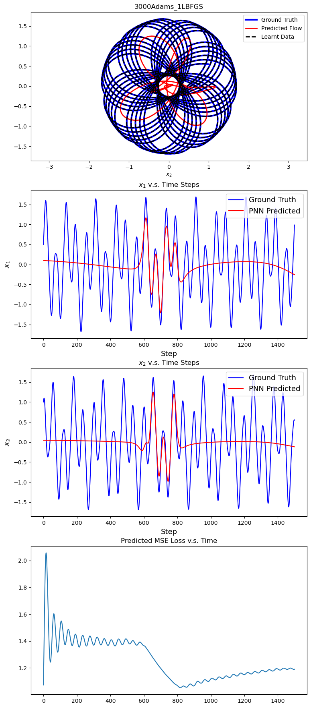
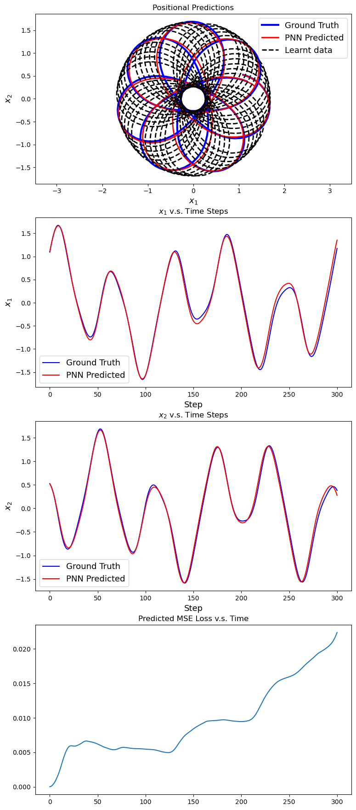

# PINN for Predicting Charged Particle's 2D Phase Flow in an Electro-Magnetic Potential
(Final Project of APMA2070 @ Brown)

Implemented in JAX(0.4.6). Data generated by a Stormer-Verlet integrator (1500 training pts + 300 testing pts)

(CUDA 11.7.1, CuDNN 8.6.0 if using GPU/TPU)

## Required Packages
`JAX`, `numpy`, `matplotlib`(For plotting), `JAXopt`(for L-BFGS optimizer), `pickle`(for saving and loading models)

# Reproduction
### Training and Testing
1. Run locally by 
```
python3 train_PINN.py --inverseprob True --savefig True --savemodel True --lamda 10.0,10.0,1.0 --lbfgs 1 --adam 7000 
```
2. Run on Oscar with SLURM script `pinn.sh`

# About the Project
Primarily uses `SympNets`, `PNNs`, `PINNs` (will only provide `PINN part` in this repo, refer to [Pengzhan Jin's `Learner` Module(PyTorch)](https://github.com/jpzxshi/learner) for `SympNet` and `PNN`; Modified to include more optimizers, i.g. L-BFGS and loading utilities) to predict future states (within a plane, a special case) of a charged particle in an electro-magnetic field, whose motion is governed by the Lorentz Force:
$$m\ddot{X} = q(E + \dot{X}\times B)$$

where $$H(V,X) = \frac{1}{2}mV^T V + q\phi(X)$$
The dynamics are tested with $m = 1, q = 1$ and initial state $Z_0 = (V_0,X_0) = (1, 0.5, 0.5, 1)$
$$A(X) = \frac{1}{3}\sqrt{x_1^2 + x_2^2}\cdot (-x_2, x_1, 0), \quad \phi(x) = \frac{1}{100 \sqrt{x_1^2 + x_2^2}}$$
Then

$$B(X) = (\nabla\times A)(x) = (0,0,\sqrt{x_1^2 + x_2^2})$$

$$E(X) = -(\nabla \phi)(x) = \frac{(x_1, x_2, 0)}{100 (x_1^2 + x_2^2)^{\frac{3}{2}}}$$

**For the Inverse Problem (identifying the values of $m$ and $q$) use argument `--inverseprob True` to set $m,q$ as traceable `jax.Array`**


## About PINN for this Task
Since PINN is essentially an approximation to a function governed by a system of PDEs or ODEs, and we are expected to predict the charged particle's trajectory (spatial location in terms of time), here we will use a linear neural network (based on [Universal Approximation Theorem](https://en.wikipedia.org/wiki/Universal_approximation_theorem)) that uses time $t$ as input and spatial location $x$ as output to approximate the trajectory of interest, i.e. $$\mathcal{N}(t) \approx x(t)$$
With initial conditions:
$$\begin{align*}\dot{X}(0) &= V_0 \\
                X(0)  &= X_0\end{align*}$$
and the Physics Equation (Lorentz force)
$$m\ddot{X} = q(E + \dot{X}\times B)$$

**Here, we will use an MLP of 8 hidden layers for 30 neurons each, input size 1 and output size at 2**

## Challenges
PINN is essentially a DeepLearning based method. Itself does not strictly abides by the Physics Laws, therefore conventional analytical and numerical techniques to solve the ODE (dynamics) may not apply. Some issues and challenges in applying PINN to this specific problem include:
1. **Computing Elementwise Derivatives (up to the Second Order)**. Different implementations(auto-diff function wrappers) are include in the `utils.auto_diff` module. Upon preliminary evaluations of performances and costs, `vmap` + reshape is chosen over the handcrafted Hessian Vector Product that uses Forward-over-Reverse mode.
2. **Excluding the Singularity at the Origin**. The electric field is is not completely 'source-less' - its magnitude along with the potential value will go to infinity at the origin. Unlike numerical methods (i.g. ODE solver, integrator, Picard Iteration etc.), PINN won't be able to handle this abnormality (`nan`$*n =$`nan` just as $0 * n = n$??). Some possible solutions might be:    - Initialize the network's biases as non-zeros to avoid initial spatial values at origin
    - Value Clipping: replace zero state ($X = [0,0]$ - rows with all zeros) in the input with $epsilon = 1e-7$ (Must be differentiable for backpropogation; Better be Jittable for performances)
However these still do not prevent the predictions of $X$ from approaching zeros. It may suggest that there should be a stronger constraints or penalty term to stop PINN from predicting trajectories that go through the origin
3. Making sure $m$ Positive. Instead of directly predicting $m$, here we choose to predict $\log m$
4. Avoiding $m$ and $q$ Going to Constant Zeros. $m=0,q=0$ will have the f_loss term trivially zero. To counter this a Regularization term calculated as the L-2 norm of $\log m$ is added to the loss function to drive the value of $\log m$ down around 0 (so that $m = e^{\log m}$ won't be 0)
5. Determining the Weights for the Sum of the Loss Terms. Now this PINN has 4 different loss terms
    - x_loss: MSE loss of $X$
    - v_loss: MSE loss of $V$
    - f_loss: Given by the Physics Equation
    - $(\log m)^2$: Regularizer 

    It's difficult the balance the influences among these terms (as the yielded results are not desireable, and the model itself is difficult to fine-tune)

## Possible Further Improvements
1. Increasing network's depth or width.
2. For the Inverse Problem, train $m$, $q$ separately, using an extra optimizers
3. Predicting the complete phase flow $(V,X)$ with temporal input $t$ instead of predicting just the spatial locations
4. Handling issues addressed above (2 - 5)

## Results Between Physics-Informed Neural Network(3000 Adam + 1 L-BFGS) and Poisson Neural Network (5000 Adam + 1 L-BFGS)
|PINN Predictions and Losses | PNN Predictions and Loss|
|:---:|:---:|
| ||
